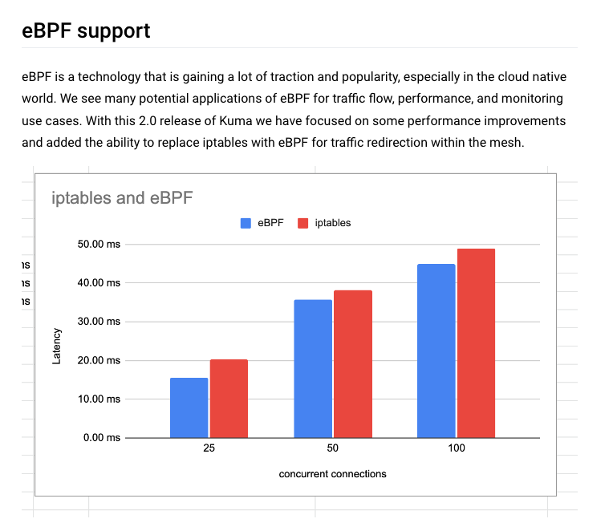

Recently, Kuma announced a major release of [v2.0](https://kuma.io/blog/2022/kuma-2-0-0/) with several new major features.
A notable feature is that Kuma is using eBPF to improve the traffic flow.

Based on the official release notes and blogs, Kuma implements the eBPF capabilities by integrating with Merbridge.

A quote from [Kuma 2.0 release blog](https://kuma.io/blog/2022/kuma-2-0-0/):

> We are utilizing the Merbridge OSS project within our eBPF capabilities and are very excited
> that we have been able to contribute back to that library and become co-maintainers. We look forward to working more
> with the Merbridge team as we continue to explore different areas to include eBPF functionality in Kuma.

As an open source project, we are very excited to see that Merbridge brings such capabitilities to Kuma.
This case proves that traffic latency can be reduced without any extra overhead if you use Merbridge in a service mesh.

Since June this year, Kuma developers have been working on integrating with Merbridge, trying to get the eBPF-based acceleration capabilities.

Thanks to the clear architecture of Merbridge, Kuma is smoothly adapted with Merbridge in days.
A big thanks to the Kuma community for contributing such an important compatibility capability to Merbridge, which helps both communities grow together!

So far, Merbridge has the capabilities to support popular service mesh products like Istio, Linkerd2, and Kuma,
and also has a clear plan to develop new features to support IPv4/IPv6 dual-stack, ambient mesh, and earlier versions of kernel.
It is exciting to see that Merbridge gets used more widely.
We really hope the project can help you land your project with eBPF technologies.
We are looking forward to receiving more comments, and having more developers get involved.
