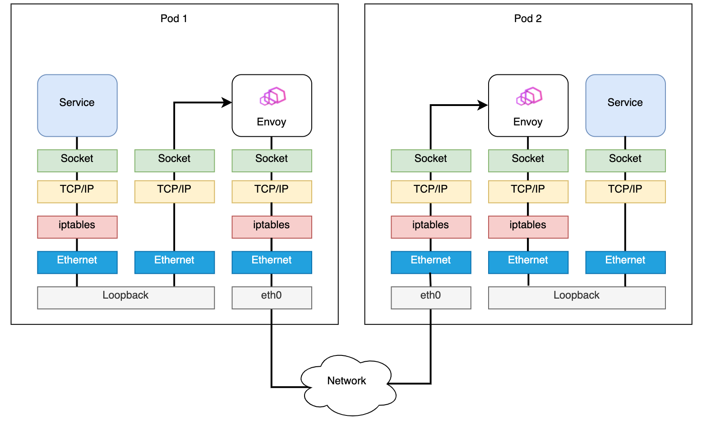

## What is Merbridge

Merbridge is designed to make traffic interception and forwarding more efficient for service mesh. It replaced iptables with eBPF.

eBPF (extended Berkeley Packet Filter) can run user's programs in the Linux kernel without modifying the kernel code or loading kernel modules. It is widely used in networking, security, monitoring and other relevant fields. Compared with iptables, Merbridge can shorten the data path between sidecars and services and therefore accelerate networking. Meanwhile, using Merbridge will not change the original architecture of Istio. The original logic is still valid. This means that if you don't want Merbridge anymore, just delete the DaemonSet. The original iptables will function again without any troubles.

## What Merbridge can do

Merbridge has following core features:

- Processing outbound traffic

  Merbridge uses eBPF’s `connect` program to modify `user_ip` and `user_port`, so as to change the destination address of a connection and ensure traffic can be sent to the new interface. In order to help Envoy identify the original destination, the application (incl. Envoy) will call the `get_sockopt` function to get `ORIGINAL_DST` when receiving a connection.

- Processing inbound traffic

  Inbound traffic is processed similarly to outbound traffic. Note that eBPF cannot take effect in a specified namespace like iptables, so changes will be global. It means that if we apply eBPF to Pods that are not originally managed by Istio, or an external IP, serious problems will occur, e.g., cannot establish a connection.

  To address this issue, we designed a tiny control plane, deployed as a DaemonSet. It can help watch and get a list of all pods on the node, similar to kubelet. Then, Pod IPs injected into the sidecar will be written into the `local_pod_ips` map. For traffic with a destination address not in the map, Merbridge will not intercept it.

- Accelerating networking

  In Istio, Envoy visits the application by the current podIP and port number. Because the podIP exists in the `local_pod_ips` map, traffic will be redirected to the podIP on port 15006, producing an infinite loop. Are there any ways for eBPF to get the IP address in the current namespace? Yes! We have designed a feedback mechanism: When Envoy tries to establish a connection, we redirect it to port 15006. When it moves to sockops, we will check if the source IP and the destination IP are the same. If yes, it means the wrong request is sent, and we will discard it in the sockops process. Meanwhile, the current ProcessID and IP will be written into the `process_ip map`, allowing eBPF to support corresponding relationship between processes and IPs. When the next request is sent, we will check directly from the `process_ip map` if the destination is the same as the current IP. Envoy will retry when the request fails. This retry process will only occur once, and subsequent connections will go very fast.

## Why Merbridge is better

In the service mesh scenario, in order to use sidecars for traffic management without the application being aware of it, ingress and egress traffic of Pods should be forwarded to the sidecar. The most common solution is using the redirect capability of iptables (netfilter) to forward the original traffic. However, this approach will increase network latency, because iptables intercept both egress and ingress traffic. For example, the traffic that originally flows directly to the application now is forwarded to the sidecar by iptables (netfilter), and the sidecar will then forward it to the final application. The data path becomes very long, since duplicated steps are performed several times.

Luckily, eBPF provides a function `bpf_msg_redirect_hash` to directly forward packets from applications in the inbound socket to the outbound socket. By doing so, packet processing can be greatly accelerated in the kernel. Therefore, we hope to replace iptables with eBPF. That's how Merbridge came into being.

## When to use Merbridge

Merbridge is recommended if you have any of following problems:

1. In scenarios that require high-performance connections, using iptables will increase latency.
    - The performance of iptables control plane and data plane degrades dramatically as the number of containers in the cluster increases. It needs to traverse and modify all the rules every time a new rule is added.
    - Systems that use IP addresses for security filtering will come under increasing pressure as Pod lifecycle is getting shorter, sometimes just a few seconds, because it requires more frequent updates of iptables rules.
    - Using iptables to achieve transparent interception needs a conntrack module for connection trace. It will cause a lot of consumption when there are many connections.
2. The system cannot use iptables for some reasons.
   - Sometimes it needs to process numerous active connections simultaneously, but using iptables is easily to have a full conntrack table.
   - Sometimes numerous connections should be processed in one second, which will exceed limit of the conntrack table. For example, if you try to process 1100 connections per second with timeout set as 120 seconds and a table capacity of 128k, it would exceed the conntrack table's limit (128k/120 seconds = 1092 connections/second).
3. Due to security concerns, some ordinary Pods cannot have too many permissions, but using Istio (without CNI) must allow these Pods to gain more permissions.
   - Running the init container may require permissions such as `NET_ADMIN`.
   - Running an iptables command may need `CAP_NET_ADMIN` permission.
   - Mounting a file system may need `CAP_SYS_ADMIN` permission.

## What Merbridge will change

Using eBPF can greatly simplify the kernel's processing of traffic and make inter-service communication more efficient.

- Before applying eBPF with Merbridge, the data path between pods is like:

  

  > Diagram From: [Accelerating Envoy and Istio with Cilium and the Linux Kernel](https://pt.slideshare.net/ThomasGraf5/accelerating-envoy-and-istio-with-cilium-and-the-linux-kernel/22)

- After applying Merbridge, the outbound traffic can skip many filter steps to improve performance:

  

  > Diagram From: [Accelerating Envoy and Istio with Cilium and the Linux Kernel](https://pt.slideshare.net/ThomasGraf5/accelerating-envoy-and-istio-with-cilium-and-the-linux-kernel/22)

- If two pods are on the same node, the connection will be even faster:

  

  > Diagram From: [Accelerating Envoy and Istio with Cilium and the Linux Kernel](https://pt.slideshare.net/ThomasGraf5/accelerating-envoy-and-istio-with-cilium-and-the-linux-kernel/22)

[Merbridge](https://github.com/merbridge/merbridge) is a completely independent open source project. It is still at an early stage, and we wish to have more users and developers engaged in. It would be greatly appreciated if you would try this new technology to accelerate your mesh, and provide us with some feedback!
