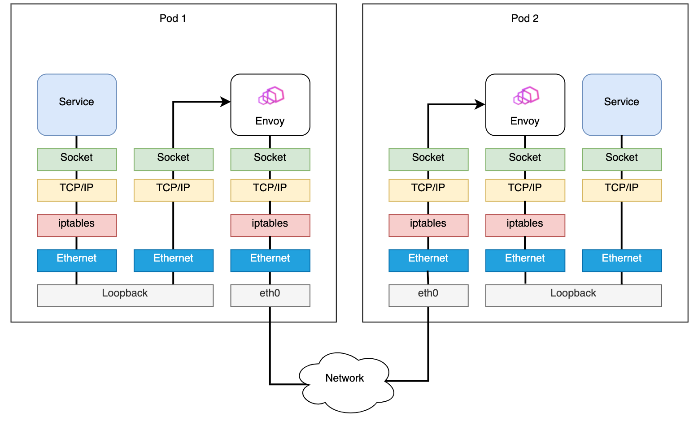
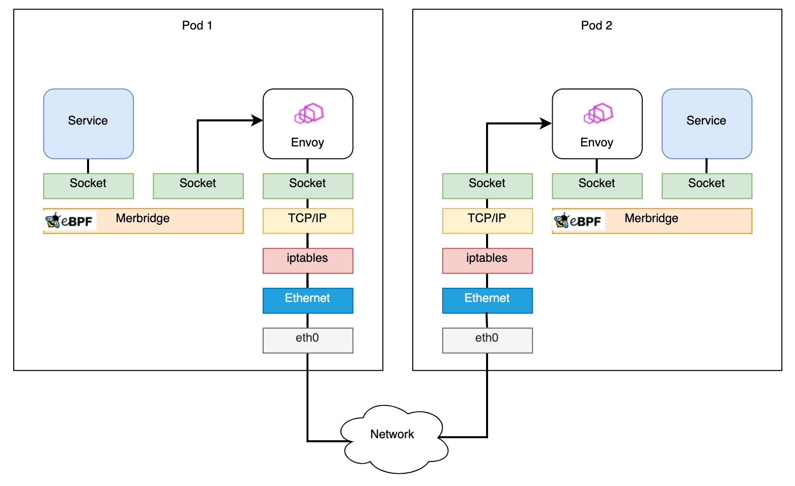
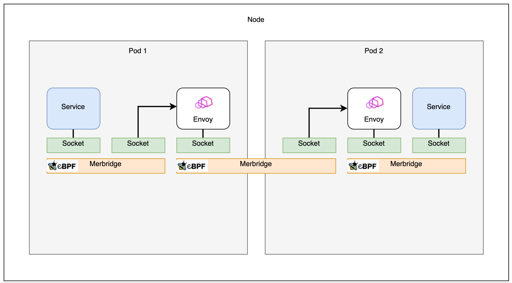

## What is Merbridge?

Merbridge enhances traffic interception and forwarding in service meshes by replacing iptables with eBPF, making the process more efficient.

eBPF (extended Berkeley Packet Filter) allows users to run programs within the Linux kernel without modifying kernel code or loading kernel modules. It is widely used in networking, security, monitoring, and related fields. Compared to iptables, Merbridge shortens the data path between sidecars and services, improving network performance. Additionally, Merbridge maintains Istio's original architecture, ensuring compatibility. If you choose to stop using Merbridge, simply deleting the DaemonSet restores iptables without any issues.

## What Merbridge Can Do

Merbridge offers the following core features:

- **Handling Outbound Traffic**
  
  Merbridge leverages eBPF's `connect` program to modify `user_ip` and `user_port`, redirecting connections to the appropriate interface. To help Envoy recognize the original destination, applications (including Envoy) call `get_sockopt` to retrieve `ORIGINAL_DST` when receiving a connection.

- **Handling Inbound Traffic**
  
  Inbound traffic follows a similar process to outbound traffic. However, unlike iptables, eBPF cannot be applied to a specific namespace—it affects the entire system. This can cause issues if eBPF is applied to Pods outside of Istio’s management or to an external IP, potentially breaking connectivity.

  To mitigate this, Merbridge includes a lightweight control plane deployed as a DaemonSet. This component monitors all Pods on a node (similar to kubelet) and maintains a `local_pod_ips` map containing the IPs of sidecar-injected Pods. Traffic with destinations not in this map remains unaffected, ensuring stability.

- **Accelerating Network Performance**
  
  In Istio, Envoy connects to applications using the current Pod IP and port. Since this Pod IP exists in the `local_pod_ips` map, traffic is redirected to the Pod IP on port 15006, creating a potential infinite loop. Merbridge solves this by implementing a feedback mechanism: when Envoy initiates a connection, it is redirected to port 15006. At the sockops level, the source and destination IPs are checked. If they match, the request is discarded to prevent the loop. Additionally, the process ID and IP are stored in the `process_ip` map, enabling eBPF to map processes to IPs. For subsequent requests, this mapping prevents redundant retries, ensuring faster connections.

## Why Merbridge Is Better

In service mesh environments, traffic must be transparently routed through sidecars without application awareness. Traditionally, this is achieved using iptables (netfilter) to redirect traffic. However, iptables-based redirection introduces latency because both egress and ingress traffic undergo multiple interception and redirection steps, unnecessarily elongating the data path.

eBPF provides a function called `bpf_msg_redirect_hash`, which enables direct packet forwarding from an inbound socket to an outbound socket, significantly improving kernel-level packet processing. The core idea behind Merbridge is to replace iptables with eBPF to streamline this process.

## When to Use Merbridge

Merbridge is recommended in the following scenarios:

1. **High-Performance Networking Requirements**

   - As container counts increase, iptables performance degrades due to the need to traverse and update rule sets frequently.
   - Systems that rely on IP-based security filtering experience higher overhead as Pod lifecycles shorten, requiring constant iptables rule updates.
   - Iptables-based transparent interception depends on the conntrack module for connection tracking, which becomes resource-intensive when handling high connection volumes.

1. **Environments Where Iptables Is Not Feasible**

   - Systems with high concurrent connections may suffer from full conntrack tables, leading to connection failures.
   - Workloads processing thousands of connections per second may exceed conntrack table limits. For example, with a table capacity of 128K and a timeout of 120 seconds, the limit is approximately 1,092 connections per second, which can be easily surpassed.

1. **Security-Conscious Environments**

   - Some Pods have limited permissions for security reasons, but Istio (without CNI) requires additional privileges.
   - Running the init container may require `NET_ADMIN` capabilities.
   - Executing iptables commands may require `CAP_NET_ADMIN` privileges.
   - Mounting certain filesystems may require `CAP_SYS_ADMIN` privileges.

In summary, Merbridge is a superior alternative to iptables, offering lower latency, higher efficiency, and easier management in high-traffic environments.

## What Changes With Merbridge?

Using eBPF simplifies kernel-level traffic processing, enhancing inter-service communication efficiency.

- **Before Merbridge**: The data path between Pods follows a complex route via iptables:

  
  
  > Diagram from: [Accelerating Envoy and Istio with Cilium and the Linux Kernel](https://pt.slideshare.net/ThomasGraf5/accelerating-envoy-and-istio-with-cilium-and-the-linux-kernel/22)

- **After Merbridge**: Outbound traffic bypasses multiple filtering steps, improving performance:

  
  
  > Diagram from: [Accelerating Envoy and Istio with Cilium and the Linux Kernel](https://pt.slideshare.net/ThomasGraf5/accelerating-envoy-and-istio-with-cilium-and-the-linux-kernel/22)

- **If Two Pods Are on the Same Node**: Communication is even faster:

  
  
  > Diagram from: [Accelerating Envoy and Istio with Cilium and the Linux Kernel](https://pt.slideshare.net/ThomasGraf5/accelerating-envoy-and-istio-with-cilium-and-the-linux-kernel/22)

[Merbridge](https://github.com/merbridge/merbridge) is an independent open-source project in its early stages. We encourage users and developers to explore this technology, provide feedback, and contribute to its evolution. By adopting Merbridge, you can achieve faster, more efficient traffic management while helping to enhance the project through real-world usage and contributions.
