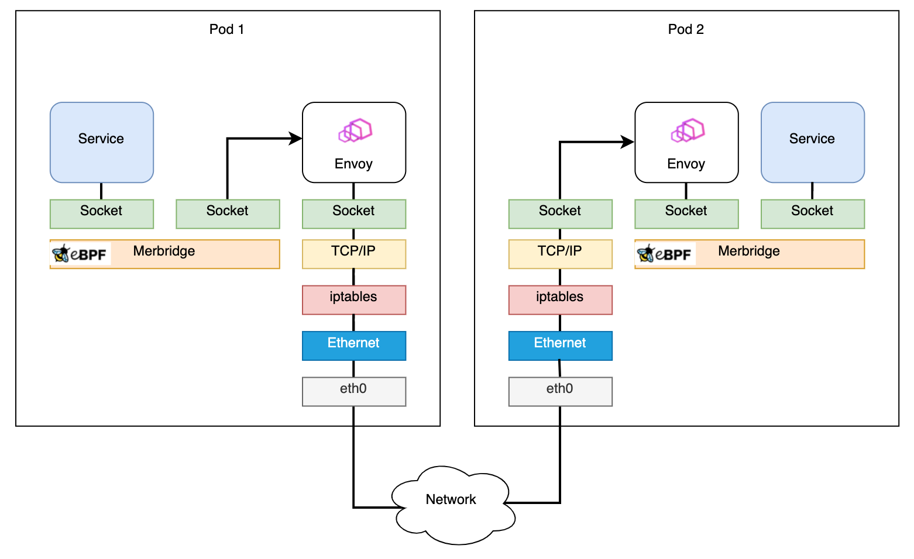
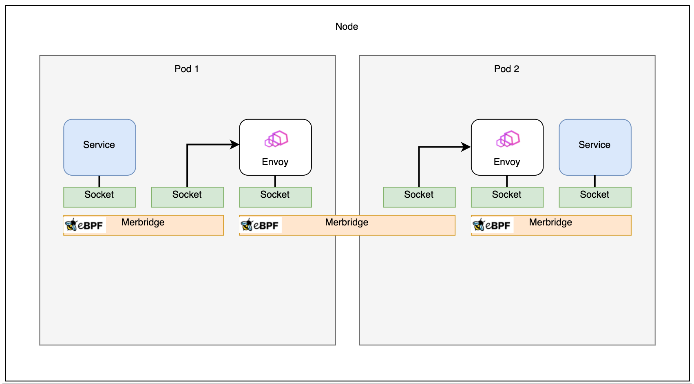

## What is Merbridge

Merbridge is designed to make traffic interception and forwarding more efficient for service mesh by replacing iptables with eBPF.

eBPF (extended Berkeley Packet Filter) allows users to run programs in the Linux kernel without modifying the kernel code or loading kernel modules. It is widely used in networking, security, monitoring, and other relevant fields. Compared to iptables, Merbridge shortens the data path between sidecars and services, thereby accelerating networking. Additionally, using Merbridge does not change the original architecture of Istio. The original logic remains valid, meaning that if you no longer want to use Merbridge, you can simply delete the DaemonSet and the original iptables will function again without any issues.

## What Merbridge can do

Merbridge has following core features:

- Processing outbound traffic

  Merbridge uses eBPF's `connect` program to modify the `user_ip` and `user_port`, in order to change the destination address of a connection and ensure that traffic can be sent to the new interface. To help Envoy identify the original destination, the application, including Envoy, will call the `get_sockopt` function to get `ORIGINAL_DST` when receiving a connection.

- Processing inbound traffic

  Inbound traffic is processed similarly to outbound traffic, but it's worth noting that eBPF cannot take effect in a specified namespace like iptables, so changes will be global. This means that if eBPF is applied to Pods that are not originally managed by Istio or to an external IP, serious problems may occur, such as not being able to establish a connection.

  To address this issue, a tiny control plane was designed and deployed as a DaemonSet. It can watch and get a list of all pods on the node, similar to kubelet. Then, Pod IPs injected into the sidecar will be written into the `local_pod_ips` map. For traffic with a destination address not in the map, Merbridge will not intercept it.

- Accelerating your network

  In Istio, Envoy visits the application by the current podIP and port number. Because the podIP exists in the `local_pod_ips` map, traffic will be redirected to the podIP on port 15006, which creates an infinite loop. A solution to this issue is to use a feedback mechanism where when Envoy tries to establish a connection, it's redirected to port 15006. When it moves to sockops, the source IP and the destination IP are checked to see if they are the same. If they are, it means that the request is incorrect and it will be discarded in the sockops process. Meanwhile, the current ProcessID and IP will be written into the `process_ip` map, allowing eBPF to support the corresponding relationship between processes and IPs. When the next request is sent, it will check directly from the `process_ip` map if the destination is the same as the current IP. Envoy will retry when the request fails. This retry process will only occur once and subsequent connections will go very fast.

## Why Merbridge is better

In the service mesh scenario, in order to use sidecars for traffic management without the application being aware of it, the ingress and egress traffic of Pods should be forwarded to the sidecar. The most common solution is using the redirect capability of iptables (netfilter) to forward the original traffic. However, this approach increases network latency because iptables intercept both egress and ingress traffic, which causes duplicated steps to be performed several times. As a result, the data path becomes very long.

eBPF provides a function called `bpf_msg_redirect_hash` which allows for directly forwarding packets from applications in the inbound socket to the outbound socket. This can greatly accelerate packet processing in the kernel. Therefore, the aim is to replace iptables with eBPF, this is the main idea behind Merbridge.

## When to use Merbridge

Merbridge is recommended if you have any of following problems:

1. In scenarios that require high-performance connections, using iptables will increase latency.
   - The performance of iptables control plane and data plane degrades as the number of containers in the cluster increases because it needs to traverse and modify all the rules every time a new rule is added.
   - Systems that use IP addresses for security filtering will come under increasing pressure as the Pod lifecycle gets shorter, sometimes just a few seconds, because it requires more frequent updates of iptables rules.
   - Using iptables to achieve transparent interception requires a conntrack module for connection trace, which causes a lot of consumption when there are many connections.
2. The system cannot use iptables for some reasons.
   - Sometimes it needs to process numerous active connections simultaneously, but using iptables easily causes a full conntrack table.
   - Sometimes numerous connections need to be processed in one second, which will exceed the limit of the conntrack table. For example, if you try to process 1100 connections per second with timeout set as 120 seconds and a table capacity of 128k, it would exceed the conntrack table’s limit (128k/120 seconds = 1092 connections/second).
3. Due to security concerns, some ordinary Pods cannot have too many permissions, but using Istio (without CNI) requires these Pods to gain more permissions.
   - Running the init container may require the `NET_ADMIN` permissions.
   - Running an iptables command may require the `CAP_NET_ADMIN` permissions.
   - Mounting a file system may require the `CAP_SYS_ADMIN` permissions.

In short Merbridge is a better alternative to iptables, as it's faster, more efficient, and easier to manage in high traffic scenarios.

## What Merbridge will change

Using eBPF can greatly simplify the kernel's processing of traffic and make inter-service communication more efficient.

- Before applying eBPF with Merbridge, the data path between pods is like:

  

  > Diagram From: [Accelerating Envoy and Istio with Cilium and the Linux Kernel](https://pt.slideshare.net/ThomasGraf5/accelerating-envoy-and-istio-with-cilium-and-the-linux-kernel/22)

- After applying Merbridge, the outbound traffic can skip many filter steps to improve performance:

  

  > Diagram From: [Accelerating Envoy and Istio with Cilium and the Linux Kernel](https://pt.slideshare.net/ThomasGraf5/accelerating-envoy-and-istio-with-cilium-and-the-linux-kernel/22)

- If two pods are on the same node, the connection will be even faster:

  

  > Diagram From: [Accelerating Envoy and Istio with Cilium and the Linux Kernel](https://pt.slideshare.net/ThomasGraf5/accelerating-envoy-and-istio-with-cilium-and-the-linux-kernel/22)

[Merbridge](https://github.com/merbridge/merbridge) is a completely independent open source project that is still in its early stages. We would greatly appreciate it if more users and developers could try this new technology to accelerate your mesh and provide feedback. By using Merbridge, you can benefit from faster and more efficient traffic management compared to using iptables, and can help to improve the project by providing feedback and participating in its development.
