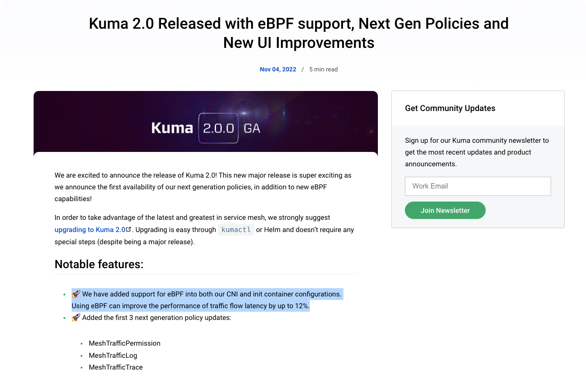
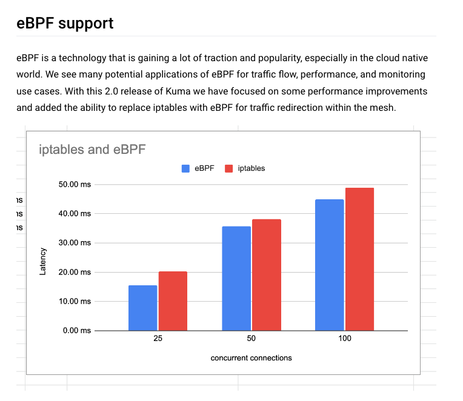

最近 Kuma 正式[发布了 2.0.0 版本](https://kuma.io/blog/2022/kuma-2-0-0/)，宣布了几项重大功能，其中第一条就是 Kuma 使用 eBPF 来加速应用访问。

根据 Kuma 官方的描述，Kuma 正是使用了 Merbridge，来实现 eBPF 的能力。

> We are utilizing the Merbridge OSS project within our eBPF capabilities and are very excited that we have been able to contribute back to that library and become co-maintainers. We look forward to working more with the Merbridge team as we continue to explore different areas to include eBPF functionality in Kuma.

我们非常高兴 Merbridge 作为一个开源项目，能够为 Kuma 提供如此令人兴奋的能力。这意味着，基本不需要任何开销，即可降低网格应用通讯延迟！

Kuma 从 6 月开始，就在着手于集成 Merbridge 项目，尝试使用社区现有的能力来为 Kuma 提供加速能力。

得益于 Merbridge 比较清晰的架构设计，Kuma 在很短的时间内就完成了对 Merbridge 的兼容。非常感谢 Kuma 社区能够为 Merbridge 贡献如此重要的兼容能力，这有助于双方社区共同成长！

截止目前，Merbridge 已经支持了 Istio、Linkerd2 和 Kuma 等主流的服务网格，也计划了很多新的特性，比如 IPv4/IPv6 双栈支持、Ambient Mesh 支持、更低的内核版本要求等。希望 Merbridge 能够被越来越广泛的应用，并且能够真实地帮助到大家。
